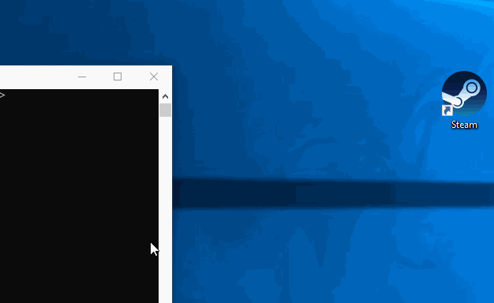

# Electron transparency mouse fix

If you don't know [Electron](https://electronjs.org/), please check out their [Github page](https://github.com/electron).

This workaround provides a very simple interface to support click-through regions on transparent applications. An example is available under the demo folder. Progress on an official fix is being discussed [here](https://github.com/electron/electron/issues/1335).

